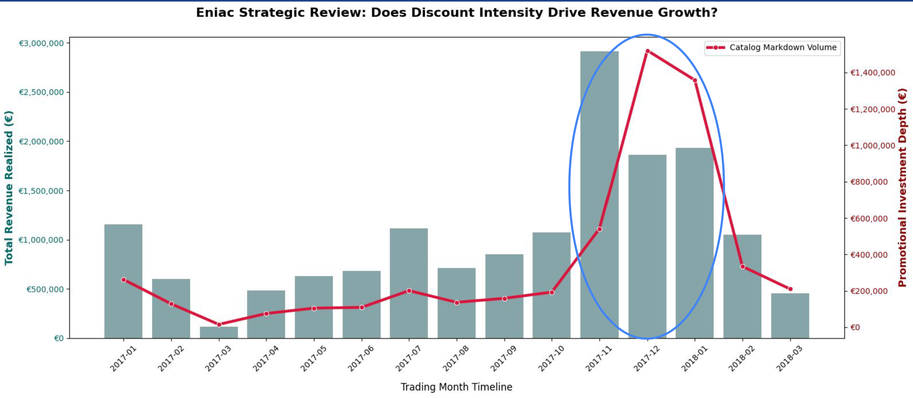
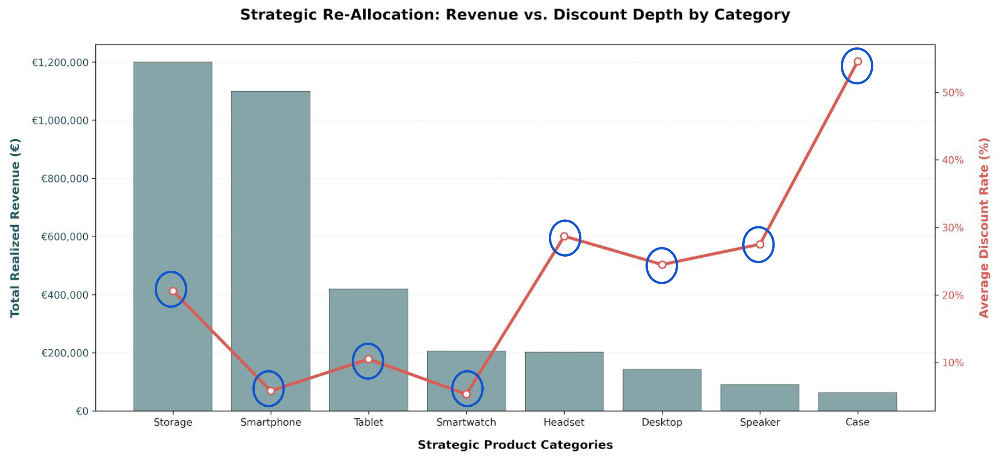
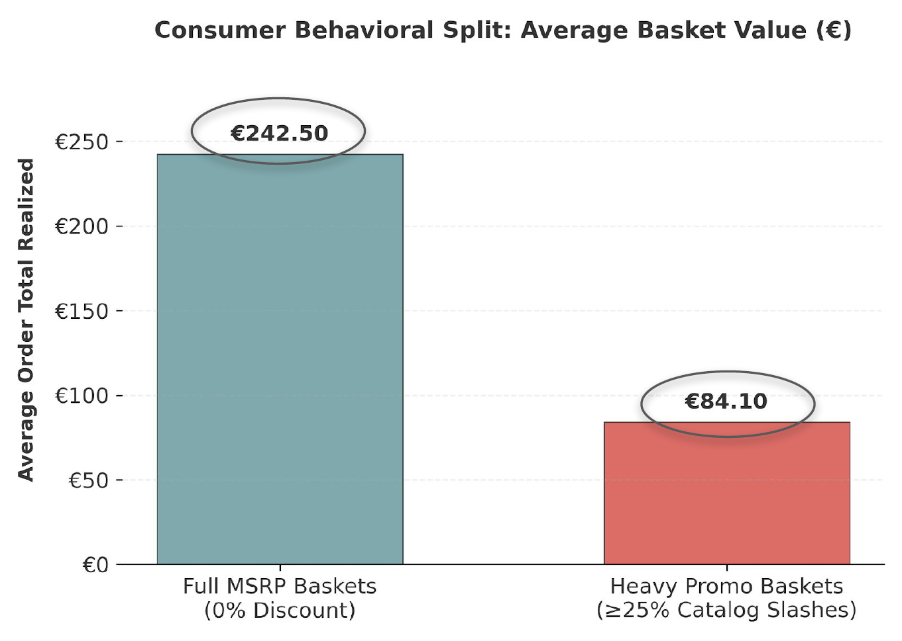

# Eniac Discount Strategy: Does Discounting Grow or Erode Revenue?

## 🎯 Project Overview

Eniac, an e-commerce retailer of Apple products and accessories, saw orders rise but revenue fall, prompting a Board investigation into whether discounting is helping or hurting the business. This project cleans two years (2017–2018) of raw internal order data and analyzes discount patterns across products, categories, and time. The analysis finds that 93% of orderlines are sold on sale, promotional spikes don't translate into lasting revenue growth, and full-price customers spend ~2x more per basket — pointing to a promotional *allocation* problem rather than a demand problem.

## 📊 Dataset & Sources

- **Source:** Internal order-management export provided by WBS Coding School as part of a Data Science course case study
- **Tables:** `orders.csv` (226,910 rows), `orderlines.csv` (293,984 rows), `products.csv` (19,327 rows), `brands.csv` (188 rows)
- **Time period:** January 2017 – March 2018
- **Key fields used:**
  - `orders.state` — order status (e.g. "Completed", "Cancelled", "Pending"); only "Completed" counts as realised revenue
  - `orders.total_paid` — total amount paid by the customer for that order, in €
  - `orderlines.unit_price` — actual sale price of the product at the time of that order (post-discount)
  - `orderlines.product_quantity` — number of units of that product purchased in the order
  - `products.price` — original list price (MSRP), used to compute the discount as `price - unit_price`
  - `products.name` / `desc` — product name and description, used to derive the product `category` (e.g. "iphone" → smartphone, "headset" → headset)
- **Data quality notes:**
  - `orders` contains a small number of rows with missing values → dropped those rows
  - `orders.created_date` is not stored as a datetime type → converted with `pd.to_datetime`
  - `orderlines.date` is not stored as a datetime type → converted with `pd.to_datetime`
  - `orderlines.unit_price` has a 2-decimal-points problem in some values (e.g. `"1.137.99"`), affecting ~12% of rows → dropped every orderline belonging to an order that contains at least one broken price (~26% of rows removed in total, to keep every remaining order's total fully consistent)
  - `orderlines.unit_price` is not stored as a float type → converted with `pd.to_numeric` after fixing the decimal problem
  - `products` contains duplicated rows (~8,700) → removed with `drop_duplicates()`, then deduplicated again on `sku` (keeping the first row) since a handful of SKUs still had conflicting duplicate rows
  - `products.desc` has missing (NaN) values → filled with the product's `name` as a fallback
  - `products.price` has missing values (~0.43% of rows) → dropped those rows, since price is essential for revenue analysis
  - `products.price` also has a 2- and 3-decimal-points problem, affecting ~5% of rows → dropped those rows, then converted the column with `pd.to_numeric`
  - `products.price` is not stored as a float type → converted with `pd.to_numeric` after fixing the decimal problem
  - `products.promo_price` has a 2- or 3-decimal-points problem in ~92% of its values → too corrupted to be reliably repaired, so the column was dropped entirely (the true promo price is recovered later from `orderlines.unit_price` instead)
  - `orders.csv` also mixes real completed sales with baskets, pending payments and cancellations → filtered to `state == "Completed"` so only realised revenue is counted

## 🚀 Key Findings & Results
 
- The raw data overstated sales volume by **26%** before cleaning — the majority of the "extra" volume came from orders containing at least one malformed price line
- Promotional depth and revenue move together month-to-month, both peaking in Nov'17–Jan'18 and both collapsing right after — **discounts behave like a short-term acquisition lever, not a durable revenue engine**
- High-revenue categories (storage, smartphones) already sell well with below-average discount rates, while lower-revenue accessory categories (cases, speakers, headsets) carry the deepest average markdowns — **Eniac has a promotional allocation problem, not a demand problem**
- **94%** of orderlines are sold at some discount, leaving only **6%** moving at full price
- Full-MSRP baskets (MSRP = Manufacturer's Suggested Retail Price, i.e. the undiscounted list price) average **€242.50** per order vs. **€84.10** for baskets with ≥25% catalog slashes — full-price customers are meaningfully more valuable per order
- **Business impact:** capping discounts on core hardware and shifting accessory clearance to bundles could protect margin without sacrificing the order volume Marketing cares about

## 🛠️ Technologies Used

- **Programming:** Python 
- **Libraries:** pandas, matplotlib, seaborn
- **Environment:** Google Colab

## 📁 Project Structure

```
eniac-discount-strategy/
├── data/
│   ├── raw/              # original CSV exports (orders, orderlines, products, brands)
│   └── processed/        # cleaned tables output by src/data_cleaning.py
├── src/
│   ├── data_cleaning.py  # loads & cleans all 4 raw tables
│   ├── categorize.py     # builds a readable product taxonomy from name/desc keywords
│   ├── analysis.py       # computes every metric behind the board presentation
│   └── visualizations.py # recreates every chart from the board presentation
├── notebooks/
│   └── eniac_discount_analysis.ipynb   # main analysis notebook — start here
├── scripts/
│   └── build_notebook.py # regenerates the notebook from src/ (for maintainers)
├── images/                # chart PNGs, also embedded below
├── reports/
│   └── Eniac_Discount_Strategy_2017-2018.pdf   # final board presentation
├── requirements.txt
└── README.md
```

## 📈 Visualizations

 **Does discount intensity drive revenue growth?**


Revenue (bars) and promotional investment depth (line) rise and fall together every month, both peaking in the Nov'17–Jan'18 sale season. Revenue never keeps growing once the promotional spike ends — discounts behave like a short-term lever, not a lasting lift.
 


**Which categories carry the discount burden?**

Storage and Smartphone generate by far the most revenue while carrying some of the lowest average discount rates. Meanwhile Headset, Speaker and Case — much smaller revenue contributors — carry the deepest average discounts, up to ~55% for Case. This is a promotional allocation problem, not a demand problem.
 

 
 
 **Do full-price customers behave differently than bargain hunters?**
<p align="center">
  
</p>
Full-MSRP (Manufacturer's Suggested Retail Price) baskets average €242.50 per order — almost 3x the €84.10 average for baskets with ≥25% catalog-wide discounts. Chasing discount-driven order volume is not the same as growing revenue per customer.


## 🔗 How to Use This Project

1. **Set up the environment:**
   ```bash
   pip install -r requirements.txt
   ```
2. **Main analysis:** open [`notebooks/eniac_discount_analysis.ipynb`](notebooks/eniac_discount_analysis.ipynb) and run all cells — it walks through cleaning, categorization, every metric, and every chart with commentary.
3. **Reproduce just the cleaned data:**
   ```bash
   python src/data_cleaning.py
   ```
4. **Reproduce just the charts:**
   ```bash
   python src/visualizations.py
   ```
5. **Board presentation:** the final, stakeholder-facing deck is in [`reports/Eniac_Discount_Strategy_2017-2018.pdf`](reports/Eniac_Discount_Strategy_2017-2018.pdf).

## 🚀 Future Work

- Build a live discount-vs-margin dashboard so pricing decisions no longer require a manual re-run of this analysis
- Model price elasticity per category to set a *data-driven* discount ceiling instead of a flat cap
- Bring in cost/margin data (not present in this export) to translate € discount given into true profit impact, not just revenue impact
- A/B test the "product bundles instead of storewide discounts" recommendation before a full rollout

## 🏆 Recommendations

- **Set price floors for core hardware** — cap discounts on Desktop and other flagship hardware at ~5% outside the November–December peak
- **Use product bundles** — pair discounted accessories (headsets, speakers, cases) with full-price hardware to clear stock without cutting hardware margins directly
- **Restrict store-wide sales to a defined peak window** — stop broad, catalog-wide discounts from December through February rather than running promotions year-round

## 👥 Team
 
This project was completed as a group project by the **Discount Detectives** team:
 
- [Your Name] — [role / GitHub profile]
- [Teammate 2] — [role / GitHub profile]
- [Teammate 3] — [role / GitHub profile]
- [Teammate 4] — [role / GitHub profile]

## 📧 Contact

Feel free to reach out with questions or feedback about this analysis.
